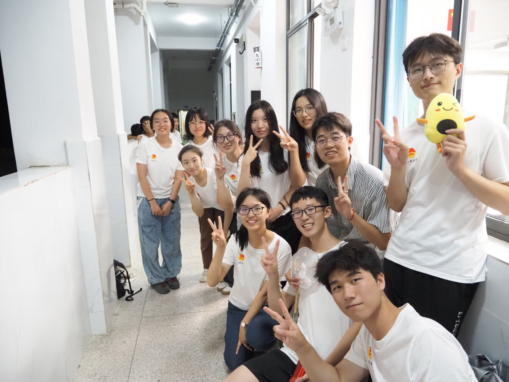

I'm a third year undergraduate student from [School of EECS](https://eecs.pku.edu.cn/), [Peking University](https://www.pku.edu.cn/). My research interest includes Backside Power Delivery Network(BSPDN), Carbon nanotubes(CNT), Bioelectrical Engineering, 3D heterogeneous design and 2D materials.

I am very fortunate to be advised by [Prof. Rongmei Chen](https://crm-prcc.github.io/) of Research Center for Carbon-based Electronics from [School of Electronics](https://ele.pku.edu.cn/), Peking University. 

You can find my CV here: [Zixuan Zhou's Curriculum Vitae](../assets/Curriculum_Vitae.pdf).

Research
======
- Backside Power Delivery Network (BSPDN) in coordination with Carbon Nanotube Field Effect Transistors (CNFETs)  
- Novel structures of Monolithic 3D design using the knowledge in BSPDN and CNFETs 
- Experiments on novel methods to do wet etch

Publication
======
Patent: Backside Power Delivery Network(BSPDN) in face of low-temperature thin-flim transistors (First author）  
Status: Submitted

Education
======
09/2022- present [School of Electronics Engineering and Computer Science (EECS)](https://eecs.pku.edu.cn/), [Peking University](https://www.pku.edu.cn/)  
09/2019-06/2022 [NO.1 Middle School affiliated to Central China Normal University](https://www.hzsdyfz.com.cn/)

Skills
======
1. Equipment for Device Fabrication: E-Beam Vapor System/Scanning Electron Microscope (SEM)/Reactive Ion Etching (RIE)/Laser Direct Writing/Step Profiler/…
1. Programming languages: C++ /Verilog/Python (seldom used by myself)
1. CAD tools: Virtuoso/ Xilinx Vivado / Xilinx Vitis HLS (beginner)

Internship
======
07/2024-08/2024 [Shanghai IC Research and Development Center (ICRD)](https://www.icrd.com.cn/index.aspx)  
I spent my summer vacation visiting and studying in ICRD, where I witnessed the industrial manufacture of IC. Shocked by the difference between fabrication in labs and that in factories, I now have a deeper understanding of “art” of device fabrication.

Course Projects
======
High Level Chip Design-[Sparse-Matrix-Multiplication](https://github.com/Zixuan-Haily-Zhou/Sparse-Matrix-Multiplication)   
Digital IC and Systems-[16bit-high-speed-adder-design](https://github.com/Zixuan-Haily-Zhou/16bit-high-speed-adder-design)  
Modeling, Analysis and Optimization for Computing System-[Boolean-Circuit-Matching](https://github.com/Zixuan-Haily-Zhou/Boolean-Circuit-Matching-SAT-/tree/main)  
Introduction to Computation-[Nogo-Game](https://github.com/Zixuan-Haily-Zhou/Nogo-Game)  

Life Beyond Research 
=====
- Give a speech on behalf of the E class in front of Nobel Laureate [Prof.Hiroshi Amano](https://en.wikipedia.org/wiki/Hiroshi_Amano)! 

- I took part in the Rural education support program in Jiangxi Province, every one is so nice!

  
<!--Create content & metadata
------
For site content, there is one markdown file for each type of content, which are stored in directories like _publications, _talks, _posts, _teaching, or _pages. For example, each talk is a markdown file in the [_talks directory](https://github.com/academicpages/academicpages.github.io/tree/master/_talks). At the top of each markdown file is structured data in YAML about the talk, which the theme will parse to do lots of cool stuff. The same structured data about a talk is used to generate the list of talks on the [Talks page](https://academicpages.github.io/talks), each [individual page](https://academicpages.github.io/talks/2012-03-01-talk-1) for specific talks, the talks section for the [CV page](https://academicpages.github.io/cv), and the [map of places you've given a talk](https://academicpages.github.io/talkmap.html) (if you run this [python file](https://github.com/academicpages/academicpages.github.io/blob/master/talkmap.py) or [Jupyter notebook](https://github.com/academicpages/academicpages.github.io/blob/master/talkmap.ipynb), which creates the HTML for the map based on the contents of the _talks directory).

**Markdown generator**

The repository includes [a set of Jupyter notebooks](https://github.com/academicpages/academicpages.github.io/tree/master/markdown_generator
) that converts a CSV containing structured data about talks or presentations into individual markdown files that will be properly formatted for the Academic Pages template. The sample CSVs in that directory are the ones I used to create my own personal website at stuartgeiger.com. My usual workflow is that I keep a spreadsheet of my publications and talks, then run the code in these notebooks to generate the markdown files, then commit and push them to the GitHub repository.

How to edit your site's GitHub repository
------
Many people use a git client to create files on their local computer and then push them to GitHub's servers. If you are not familiar with git, you can directly edit these configuration and markdown files directly in the github.com interface. Navigate to a file (like [this one](https://github.com/academicpages/academicpages.github.io/blob/master/_talks/2012-03-01-talk-1.md) and click the pencil icon in the top right of the content preview (to the right of the "Raw | Blame | History" buttons). You can delete a file by clicking the trashcan icon to the right of the pencil icon. You can also create new files or upload files by navigating to a directory and clicking the "Create new file" or "Upload files" buttons. 

Example: editing a markdown file for a talk

For more info
------
More info about configuring Academic Pages can be found in [the guide](https://academicpages.github.io/markdown/), the [growing wiki](https://github.com/academicpages/academicpages.github.io/wiki), and you can always [ask a question on GitHub](https://github.com/academicpages/academicpages.github.io/discussions). The [guides for the Minimal Mistakes theme](https://mmistakes.github.io/minimal-mistakes/docs/configuration/) (which this theme was forked from) might also be helpful.-->
